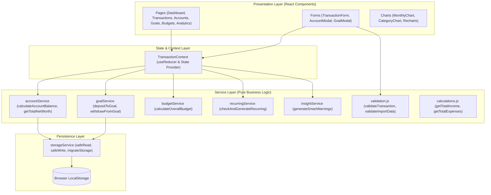
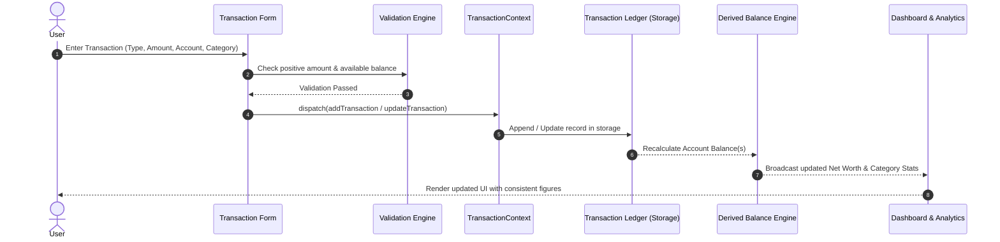
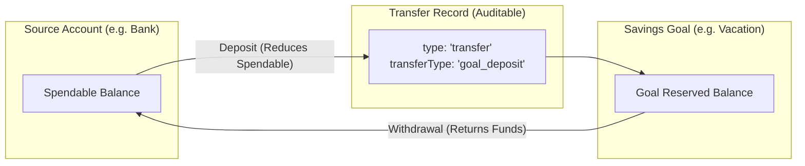

# FinTrack

> **Personal Finance Tracker** — A modern, private, and deterministic personal finance management web application built with React, Vite, and Tailwind CSS.

[](https://react.dev/)
[](https://vitejs.dev/)
[](https://tailwindcss.com/)
[](https://reactrouter.com/)
[](https://recharts.org/)
[](LICENSE)

---

## Table of Contents

1. [Overview](#overview)
2. [Key Features](#key-features)
3. [Tech Stack](#tech-stack)
4. [Architecture & Accounting Principles](#architecture--accounting-principles)
   - [Core Financial Invariant](#core-financial-invariant)
   - [System Architecture](#system-architecture)
   - [Data & Ledger Flow](#data--ledger-flow)
   - [Savings Goal Flow](#savings-goal-flow)
5. [Project Structure](#project-structure)
6. [Getting Started](#getting-started)
   - [Prerequisites](#prerequisites)
   - [Installation](#installation)
   - [Available Scripts](#available-scripts)
7. [Validation & Business Rules](#validation--business-rules)
8. [Automated Testing](#automated-testing)
9. [Data Backup, Export & Portability](#data-backup-export--portability)
10. [Privacy & Security](#privacy--security)
11. [Known Limitations](#known-limitations)
12. [Future Roadmap](#future-roadmap)
13. [License](#license)

---

## Overview

**FinTrack** is a client-side personal finance tracker designed for speed, clarity, and absolute privacy. It provides comprehensive financial tracking — including multi-account balances, categorized income and expenses, monthly budgets, recurring transactions, and savings goals — without sending your personal data to any external server.

FinTrack enforces strict **single-source-of-truth accounting**: account balances are never manually altered via arbitrary counters; instead, every balance is mathematically derived from your immutable opening balances and ledger transactions.

---

## Key Features

- **Dynamic Financial Dashboard**: Real-time overview of net worth, monthly income vs. expenses, net savings rate, budget usage progress, category spending donuts, and recent transactions.
- **Multi-Account & Wallet Management**: Track Cash, Bank Accounts, UPI / Wallets, Credit Cards, and custom accounts with independent opening balances and real-time derived balances.
- **Income & Expense Tracking**: Strict categorization, date selection, payment method metadata filtering, and rich search/filter capabilities across descriptions, notes, accounts, and categories.
- **Atomic Savings Goals**: Create targets with target dates, visual progress bars, and execute secure deposit and withdrawal transfers between accounts and goals without creating artificial income or expenses.
- **Monthly Category Budgets**: Set spending limits per category per month with real-time budget burn rate indicators and automated overspending warnings.
- **Automated Recurring Transactions**: Schedule daily, weekly, monthly, or yearly transactions with automatic generation upon app launch.
- **Financial Calendar**: Interactive monthly calendar with daily income, expense, and net cashflow heatmaps and day-level transaction inspection.
- **Advanced Analytics & Charts**: Interactive Recharts visualizations featuring monthly cash flow bar charts, category spending distributions, 3/6/12-month trends, and expense-to-income ratios.
- **Smart Financial Insights**: Proactive system alerts detecting high burn rates, negative account balances, overdue goals, and upcoming recurring commitments.
- **Full Data Backup & Restore**: One-click JSON export/import with schema validation and CSV transaction export for spreadsheet analysis.
- **Curated Multi-Currency & Theming**: Built-in support for INR (`₹`), USD (`$`), EUR (`€`), GBP (`£`), and JPY (`¥`), alongside Light, Dark, and System theme modes.

---

## Tech Stack

| Layer | Technology | Purpose |
|---|---|---|
| **Core Framework** | [React 19](https://react.dev/) | Component-driven declarative UI |
| **Build Tool & Bundler** | [Vite 8](https://vitejs.dev/) | Lightning-fast HMR and optimized production bundling |
| **Routing** | [React Router v7](https://reactrouter.com/) | Client-side page routing and stateful navigation |
| **Styling** | [Tailwind CSS v4](https://tailwindcss.com/) & CSS Variables | Responsive design and system-aware dark mode |
| **Animations** | [Motion](https://motion.dev/) | Micro-interactions, animated entries, and modal transitions |
| **Charts** | [Recharts](https://recharts.org/) | Responsive SVG charts (Bar, Area, Pie, Line) |
| **Icons** | [Lucide React](https://lucide.dev/) | Clean, accessible UI icons |
| **Data Persistence** | Browser `localStorage` | Fast, offline-first client storage with schema migration |
| **Identifiers** | [UUID v14](https://github.com/uuidjs/uuid) | Cryptographically unique transaction and entity IDs |

---

## Architecture & Accounting Principles

### Core Financial Invariant

FinTrack treats the **Transaction Ledger** as the single source of truth. Account balances are never stored as mutable scalar numbers that get updated via ad-hoc `+=` or `-=` operations.

$$\text{Account Balance} = \text{Opening Balance} + \sum \text{Inflows} - \sum \text{Outflows}$$

Where:
- **Inflows**: Income transactions assigned to the account + Savings Goal Withdrawals deposited into the account.
- **Outflows**: Expense transactions assigned to the account + Savings Goal Deposits transferred from the account.

```
Total Net Worth = ∑ (Individual Account Balances)
```

### System Architecture



### Data & Ledger Flow



### Savings Goal Flow

FinTrack models Savings Goals as **physical balance allocations (Model B)**: transferring money into a goal removes it from the source account's spendable balance and places it in the goal's protected balance, preventing accidental overspending.



---

## Project Structure

```
ExpenseTracker/
├── frontend/
│   ├── index.html                   # HTML entry point with meta tags & Google Fonts
│   ├── package.json                 # Project dependencies and npm scripts
│   ├── vite.config.js               # Vite configuration (Tailwind & React plugins)
│   ├── eslint.config.js             # ESLint configuration rules
│   ├── test_transaction_rules.js    # Automated test suite (Cases A through L)
│   ├── test_edge_cases.js           # Supplementary edge-case test suite
│   ├── public/                      # Static public assets
│   └── src/
│       ├── App.jsx                  # Main application component & routes
│       ├── main.jsx                 # React root renderer
│       ├── index.css                # Global CSS styles, theme tokens, and reset
│       ├── components/
│       │   ├── common/              # Reusable UI primitives (Button, Card, Modal, Badge, Toast)
│       │   ├── dashboard/           # Dashboard widgets (SummaryCard, MonthlyChart, CategoryChart, RecentTransactions)
│       │   ├── forms/               # Input forms (TransactionForm with live validation)
│       │   ├── layout/              # Layout shell (Sidebar, Header, MobileNav, AppLayout)
│       │   └── notifications/       # Smart insight warning badges & popovers
│       ├── context/
│       │   └── TransactionContext.jsx # Central application state & action dispatchers
│       ├── data/
│       │   └── categories.js        # Default categories, currencies, and payment method mappings
│       ├── pages/
│       │   ├── Dashboard.jsx        # Executive financial summary
│       │   ├── Transactions.jsx     # Transaction list with multi-filtering and CSV export
│       │   ├── AddTransaction.jsx   # New transaction entry view
│       │   ├── EditTransaction.jsx  # Edit view with transaction reversal mechanics
│       │   ├── Accounts.jsx         # Account and wallet management
│       │   ├── Goals.jsx            # Savings goals with deposit/withdraw transfers
│       │   ├── Budgets.jsx          # Monthly category budgeting
│       │   ├── Calendar.jsx         # Daily cashflow heatmap & calendar view
│       │   ├── Recurring.jsx        # Recurring transaction scheduler
│       │   ├── Analytics.jsx        # Detailed charts, trends, and breakdowns
│       │   ├── Settings.jsx         # Currency, theme, and full JSON backup/restore
│       │   └── Landing.jsx          # Introductory feature showcase
│       ├── services/
│       │   ├── accountService.js    # Balance calculation, net worth, and edit headroom
│       │   ├── budgetService.js     # Budget limit tracking and utilization formulas
│       │   ├── categoryService.js   # Category lookups and custom category management
│       │   ├── goalService.js       # Atomic goal deposits, withdrawals, and progress metrics
│       │   ├── insightService.js    # Smart financial warning generator
│       │   ├── recurringService.js  # Recurring schedule evaluation and generation
│       │   ├── storageService.js    # LocalStorage safe reader/writer and schema migration
│       │   └── storage.js           # High-level storage facade and backup exporters
│       └── utils/
│           ├── calculations.js      # Income, expense, and time-range aggregations
│           ├── formatters.js        # Currency, date, and short number formatters
│           └── validation.js        # Form validation and JSON backup schema validation
└── README.md
```

---

## Getting Started

### Prerequisites

- [Node.js](https://nodejs.org/) version **18.0.0** or higher
- `npm` (bundled with Node.js)

### Installation

1. Clone the repository:
   ```bash
   git clone https://github.com/sandip234-ui/ExpenseTracker.git
   cd ExpenseTracker/frontend
   ```

2. Install dependencies:
   ```bash
   npm install
   ```

3. Start the local development server:
   ```bash
   npm run dev
   ```

4. Open your browser and navigate to `http://localhost:5173`.

### Available Scripts

In the `frontend` directory, you can run:

| Command | Description |
|---|---|
| `npm run dev` | Starts the Vite development server with Hot Module Replacement (HMR). |
| `npm run build` | Compiles and bundles production-ready assets into the `dist/` folder. |
| `npm run preview` | Locally serves the production build from `dist/` for verification. |
| `npm run lint` | Runs ESLint to inspect JavaScript and JSX code quality. |
| `node test_transaction_rules.js` | Executes the 12-suite automated business rules test. |

---

## Validation & Business Rules

### 1. Categories
- **Income Categories**: Strictly restricted to `Salary`, `Freelance`, `Business`, `Investment`, `Gift`, `Other` (and user-created custom income categories).
- **Expense Categories**: Strictly restricted to `Food`, `Transport`, `Shopping`, `Bills`, `Education`, `Entertainment`, `Health`, `Travel`, `Subscriptions`, `Other` (and user-created custom expense categories).

### 2. Expense Balance Check
- An expense is rejected if `amount > availableAccountBalance`.
- Clear, actionable error messages are displayed (e.g. `Insufficient balance. Available in Bank Account: ₹15,000.00`). No silent value clipping occurs.

### 3. Edit Reversal Workflow
- When editing an existing transaction, the original transaction's balance effect is **reversed** before checking if the new expense amount can be afforded.
- *Example*: An existing ₹7,000 expense on an account with a current balance of ₹15,000 gives an available headroom of ₹22,000 (`₹15,000 + ₹7,000`). Editing the expense to ₹18,000 is valid, resulting in a final balance of ₹4,000.

### 4. Payment Method Decoupling
- Payment method is purely optional metadata and **never** participates in balance math.
- Automatic filtering prevents contradictory UI selections:
  - **Cash Account**: `Cash`, `Other`
  - **Bank Account**: `UPI`, `Debit Card`, `Net Banking`, `Cheque`, `Other`
  - **UPI / Wallet**: `UPI`, `Wallet`, `Other`

### 5. Descriptions
- Descriptions are completely free-text with no keyword or semantic blocking (e.g., an income entry described as "Spending refund" is fully valid).

---

## Automated Testing

FinTrack includes standalone Node.js test suites to verify that financial math and edge cases execute flawlessly without requiring a browser runner:

```bash
# Run the complete transaction business rules test suite
node test_transaction_rules.js
```

### Verified Test Cases:
- **Test A**: Income applied to Bank increases balance accurately.
- **Test B**: Expense applied to Bank decreases balance accurately.
- **Test C**: Expense exceeding balance is rejected with descriptive error.
- **Test D**: Editing expense amount reverses old transaction and accepts valid new amount.
- **Test E**: Editing income amount reverses old income and applies new amount.
- **Test F**: Changing an expense to income reverses expense and adds income atomically.
- **Test G**: Changing income to expense validates available headroom before applying.
- **Test H**: Changing accounts during edit credits the old account and debits the new account.
- **Test I**: Category lists strictly validated per type; free-text descriptions unrestricted.
- **Test J**: Payment methods filtered accurately per account type.
- **Test K**: Changing accounts preserves payment method if valid; resets if invalid.
- **Test L**: Legacy/custom payment methods preserved and rendered without crash.

---

## Data Backup, Export & Portability

Because FinTrack is local-first, it provides built-in tools in **Settings** to protect and move your financial history:

- **Full JSON Backup**: Exports transactions, accounts, custom categories, monthly budgets, savings goals, recurring rules, and preferences in a structured JSON file.
- **Full JSON Restore**: Imports previously exported backups with strict schema validation and duplicate ID protection.
- **CSV Export**: Downloads a formatted CSV file of all (or filtered) transactions compatible with Excel, Google Sheets, or Numbers.

---

## Privacy & Security

- **Zero External Telemetry**: FinTrack does not send your financial numbers, descriptions, or account details to any remote server or analytics provider.
- **Local Storage Only**: All data is stored in your browser's `localStorage`.
- **Offline Capable**: The application functions completely without an active internet connection once loaded.
- **Safe JSON Import**: Imported backup files are checked for schema integrity, required attributes, and type safety before being written to storage.

---

## Known Limitations

- **Browser-Bound Persistence**: Data stored in `localStorage` is tied to the specific browser and device profile. Clearing browser cache or site data will erase local records unless backed up via JSON.
- **No Cloud Sync / Multi-Device Sync**: There is currently no backend database or cloud user authentication. To transfer data between devices, use the **Export JSON** and **Import JSON** feature in Settings.
- **Single Currency Display**: While multiple international currencies are supported, currency conversion rates are not fetched dynamically; the selected currency symbol is applied across all accounts.

---

## Future Roadmap

- [ ] PWA (Progressive Web App) offline service worker & installation support.
- [ ] End-to-end encrypted optional cloud sync (WebDAV / Google Drive / Self-hosted backend).
- [ ] Multi-currency support with live or custom exchange rates per account.
- [ ] Receipt / invoice image attachment via IndexedDB storage.
- [ ] Advanced budget forecasting using historical trend analysis.
- [ ] Split transaction capabilities across multiple categories.

---

## License

This project is licensed under the **MIT License** — see the [LICENSE](LICENSE) file for details.
